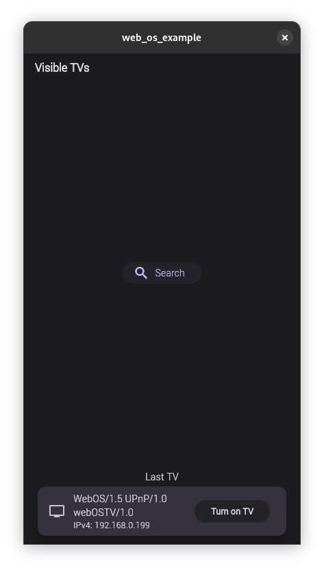
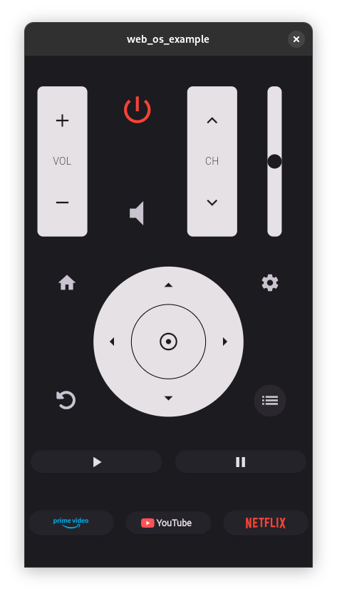

# WEB OS Remote Controller

 

Controle remoto para TVs que utilizam o sistema [WebOS](https://webostv.developer.lge.com/).
Essa aplicação foi feita Utilizando Flutter-dart e Tokio-rust, suportando Linux e Android.

## Get Started

Para compilar esta aplicação é preciso ter instalado tando [Flutter](https://docs.flutter.dev/get-started/install) quando o toolkit do [rust](https://www.rust-lang.org/tools/install).
Para compilar o código em rust para android e linux, é necessário adicionar as **abis**:

```bash
rustup target add armv7-linux-androideabi   # for arm
rustup target add i686-linux-android        # for x86
rustup target add aarch64-linux-android     # for arm64
rustup target add x86_64-linux-android      # for x86_64
rustup target add x86_64-unknown-linux-gnu  # for linux-x86-64
```

Instale a versão correta do **NDK** localizada no arquivo [build.gradle](./web_os/android/build.gradle). Essa aplicação utiliza o plugin da mozila [rust-android-gradle](https://github.com/mozilla/rust-android-gradle).


## Executando testes

Executando testes em dart-flutter

```bash
flutter test
```

Executando testes do código em rust

```bash
cd ./web_os
cargo t
```

## Comandos úteis

Desenvolvendo para o dispositivo Android sem a necessidade do cabo USB

```bash
# Parear um dispositivo android
adb pair <phone-ip>:<port>
# conectando ao dispositovo android
adb connect <phone-ip>:<port>
```
